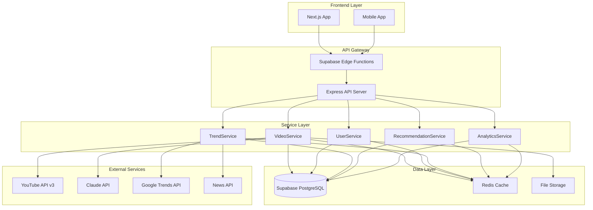
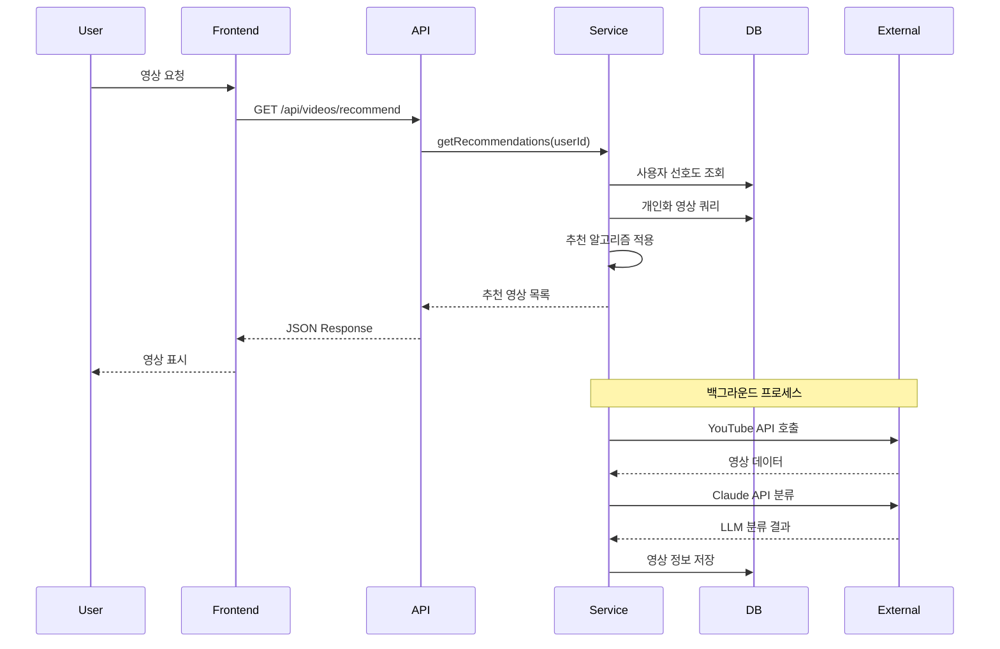

# 🚀 Momentum YouTube AI 큐레이션 서비스 - 최종 구현 가이드

## Part 1: 프로젝트 개요 + 아키텍처 + 설계 원칙

> **Version**: 4.0 FINAL  
> **Last Updated**: 2025-01-13  
> **Platform**: Supabase (PostgreSQL 14+)  
> **Created by**: Wave Team

---

## 📋 목차

1. [프로젝트 개요](#1-프로젝트-개요)
2. [시스템 아키텍처](#2-시스템-아키텍처)
3. [데이터베이스 설계 원칙](#3-데이터베이스-설계-원칙)
4. [기술 스택](#4-기술-스택)
5. [핵심 요구사항](#5-핵심-요구사항)

---

## 1. 프로젝트 개요

### 1.1 프로젝트 소개

**Momentum**은 AI 기반 YouTube Shorts 큐레이션 서비스로, 사용자의 선호도와 감정 상태를 분석하여 개인화된 짧은 영상을 추천합니다.

### 1.2 핵심 가치 제안

```yaml
주요 기능:
  - AI 기반 영상 분류: Claude API를 활용한 정확한 콘텐츠 분석
  - 개인화 추천: 사용자 행동 패턴 기반 맞춤형 추천
  - 감정 기반 큐레이션: 사용자의 현재 감정 상태에 적합한 영상 제공
  - 실시간 트렌드: Google Trends와 뉴스 기반 최신 트렌드 반영
  - 고품질 필터링: 채널 품질 평가를 통한 우수 콘텐츠만 제공
```

### 1.3 목표 지표

| 지표              | 목표     | 설명                 |
| ----------------- | -------- | -------------------- |
| **응답 시간**     | < 100ms  | 개인화 추천 API 응답 |
| **동시 사용자**   | 10,000+  | 동시 접속 처리 능력  |
| **일일 처리량**   | 100,000+ | 영상 처리 개수       |
| **추천 정확도**   | > 80%    | 사용자 만족도 기준   |
| **시스템 가용성** | 99.9%    | 서비스 가동률        |

---

## 2. 시스템 아키텍처

### 2.1 전체 아키텍처



### 2.2 데이터 플로우



### 2.3 도메인 구조

```yaml
domains:
  user_domain:
    description: "사용자 관련 모든 데이터"
    tables:
      - user_profiles: "사용자 기본 정보"
      - user_keyword_preferences: "키워드 선호도"
      - user_video_interactions: "영상 상호작용"

  video_domain:
    description: "영상 관련 모든 데이터"
    tables:
      - videos: "YouTube 영상 정보"
      - video_classifications: "LLM 분류 결과"
      - keyword_video_mappings: "키워드-영상 매핑"
      - channel_profiles: "채널 정보"

  trend_domain:
    description: "트렌드 관련 데이터"
    tables:
      - trend_keywords: "트렌드 키워드"
      - trend_video_mappings: "트렌드-영상 매핑"

  recommendation_domain:
    description: "추천 관련 데이터"
    tables:
      - emotion_keyword_preferences: "감정별 키워드"
      - recommendation_logs: "추천 로그"

  system_domain:
    description: "시스템 운영 데이터"
    tables:
      - search_sessions: "검색 세션"
      - api_usage_logs: "API 사용 로그"
      - scheduled_tasks: "스케줄 작업"
      - system_notifications: "시스템 알림"
      - analytics_events: "분석 이벤트"
```

---

## 3. 데이터베이스 설계 원칙

### 3.1 핵심 설계 원칙

#### 1. **실용성 우선 (Pragmatism First)**

```yaml
원칙: "실제 서비스 코드와의 완벽한 호환성"
적용:
  - dailyKeywordUpdateService.js와 직접 연동
  - trendVideoService.js 데이터 구조 그대로 반영
  - 기존 서비스 로직 수정 최소화
```

#### 2. **확장성 고려 (Scalability by Design)**

```yaml
원칙: "미래 기능을 위한 유연한 구조"
적용:
  - JSONB 필드로 유연한 메타데이터 저장
  - 파티션 테이블로 대용량 데이터 관리
  - 벡터 검색을 위한 pgvector 준비
```

#### 3. **성능 최적화 (Performance Optimization)**

```yaml
원칙: "응답 시간 100ms 이하"
적용:
  - 핵심 쿼리별 전용 인덱스
  - 복합 인덱스로 조인 최적화
  - 부분 인덱스로 선택적 쿼리 가속
  - 함수 기반 인덱스 활용
```

#### 4. **데이터 무결성 (Data Integrity)**

```yaml
원칙: "신뢰할 수 있는 데이터"
적용:
  - 외래 키 제약으로 참조 무결성
  - CHECK 제약으로 값 유효성 검증
  - UNIQUE 제약으로 중복 방지
  - 트리거로 자동 데이터 관리
```

#### 5. **보안 중심 (Security First)**

```yaml
원칙: "데이터 접근 권한 엄격 관리"
적용:
  - RLS로 행 수준 보안
  - 역할 기반 접근 제어
  - API 키 암호화 저장
  - 민감 정보 마스킹
```

### 3.2 명명 규칙

```yaml
tables:
  format: "snake_case"
  plural: true
  examples: ["user_profiles", "video_classifications"]

columns:
  format: "snake_case"
  boolean_prefix: "is_", "has_"
  timestamp_suffix: "_at"
  examples: ["is_playable", "created_at"]

indexes:
  format: "idx_{table}_{column}"
  composite: "idx_{table}_{col1}_{col2}"
  examples: ["idx_videos_video_id", "idx_videos_playable_quality"]

constraints:
  primary_key: "pk_{table}"
  foreign_key: "fk_{table}_{column}"
  unique: "uq_{table}_{column}"
  check: "ck_{table}_{condition}"

functions:
  format: "snake_case"
  prefix_by_type:
    - "get_": 조회 함수
    - "calculate_": 계산 함수
    - "update_": 업데이트 함수
    - "cleanup_": 정리 함수
```

### 3.3 데이터 타입 선택 기준

```yaml
identifiers:
  primary_key: "UUID" # 분산 시스템 대비
  youtube_id: "VARCHAR(20)" # YouTube 고정 길이

strings:
  short: "VARCHAR(n)" # 고정 길이 문자
  long: "TEXT" # 가변 길이 문자

numbers:
  count: "INTEGER" # 일반 카운트
  large_count: "BIGINT" # 조회수 등
  score: "DECIMAL(p,s)" # 정밀도 필요

dates:
  timestamp: "TIMESTAMPTZ" # 시간대 포함
  date_only: "DATE" # 날짜만

arrays:
  tags: "TEXT[]" # 태그, 키워드

json:
  flexible: "JSONB" # 유연한 구조
```

### 3.4 최적화 전략

#### 1. **인덱스 전략**

```sql
-- 단일 컬럼 인덱스: 자주 조회되는 컬럼
CREATE INDEX idx_videos_video_id ON videos(video_id);

-- 복합 인덱스: 함께 사용되는 컬럼들
CREATE INDEX idx_videos_keyword_quality ON videos(search_keyword, quality_score DESC);

-- 부분 인덱스: 특정 조건만 인덱싱
CREATE INDEX idx_videos_playable ON videos(is_playable) WHERE is_playable = true;

-- GIN 인덱스: 배열/JSONB 검색
CREATE INDEX idx_video_classifications_emotion_tags ON video_classifications USING GIN(emotion_tags);
```

#### 2. **파티션 전략**

```sql
-- 시계열 데이터는 월별 파티션
CREATE TABLE analytics_events (...) PARTITION BY RANGE (created_at);

-- 자동 파티션 생성 함수
CREATE OR REPLACE FUNCTION create_monthly_partition()...
```

#### 3. **캐싱 전략**

```yaml
cache_layers:
  - Redis: "핫 데이터 (추천 결과, 트렌드)"
  - PostgreSQL: "영상 메타데이터 캐시"
  - CDN: "썸네일, 정적 자원"

cache_invalidation:
  - TTL: "시간 기반 만료"
  - Event: "데이터 변경 시 무효화"
  - Manual: "관리자 수동 새로고침"
```

---

## 4. 기술 스택

### 4.1 핵심 기술

| 구분          | 기술       | 버전   | 용도              |
| ------------- | ---------- | ------ | ----------------- |
| **Database**  | PostgreSQL | 14+    | 메인 데이터베이스 |
| **Platform**  | Supabase   | Latest | BaaS 플랫폼       |
| **Backend**   | Node.js    | 18+    | 서버 런타임       |
| **Framework** | Express    | 4.x    | API 서버          |
| **AI/ML**     | Claude API | 3.5    | 영상 분류         |
| **Cache**     | Redis      | 7.x    | 인메모리 캐시     |
| **Queue**     | Bull       | 4.x    | 작업 큐           |

### 4.2 주요 라이브러리

```json
{
  "dependencies": {
    "@supabase/supabase-js": "^2.x",
    "googleapis": "^120.x",
    "@anthropic-ai/sdk": "^0.x",
    "express": "^4.x",
    "bull": "^4.x",
    "ioredis": "^5.x",
    "zod": "^3.x",
    "winston": "^3.x",
    "node-cron": "^3.x"
  }
}
```

### 4.3 외부 API

```yaml
youtube_api:
  version: "v3"
  endpoints:
    - search.list
    - videos.list
    - channels.list
  quota: 10000/day

claude_api:
  model: "claude-3-sonnet"
  usage: "영상 분류"
  rate_limit: "5 req/sec"

google_trends:
  regions: ["KR"]
  categories: ["all"]

news_api:
  sources: ["korean_news"]
  language: "ko"
```

---

## 5. 핵심 요구사항

### 5.1 기능 요구사항

#### 1. **사용자 시스템**

```yaml
requirements:
  - 사용자 인증/인가 (Supabase Auth)
  - 티어별 기능 제한 (free/premium/pro)
  - 키워드 선호도 추적 (선택 횟수 기반)
  - 시청 기록 관리
  - 개인 설정 저장
```

#### 2. **영상 수집 및 분류**

```yaml
requirements:
  - YouTube API 데이터 완전 저장
  - Claude API 5가지 분류 필드
  - 품질 점수 자동 계산
  - 채널 품질 평가
  - 중복 제거 및 캐시 관리
```

#### 3. **추천 시스템**

```yaml
requirements:
  - 개인화 추천 (사용자 선호도 기반)
  - 감정 기반 추천 (집단 데이터)
  - 트렌드 기반 추천
  - 유사 영상 추천
  - 다양성 보장 알고리즘
```

#### 4. **트렌드 분석**

```yaml
requirements:
  - Google Trends 실시간 수집
  - 뉴스 기반 키워드 정제
  - 채널 품질 필터링
  - 24시간 주기 업데이트
  - 지역별 트렌드 지원
```

### 5.2 비기능 요구사항

#### 1. **성능**

- 응답 시간: 100ms 이하 (95 percentile)
- 처리량: 1,000 TPS 이상
- 동시 접속: 10,000 사용자

#### 2. **확장성**

- 수평적 확장 가능
- 마이크로서비스 전환 대비
- 멀티 리전 지원 가능

#### 3. **가용성**

- 99.9% 가동률
- 자동 failover
- 백업 및 복구 전략

#### 4. **보안**

- HTTPS 전용
- API 키 암호화
- Rate limiting
- DDoS 방어

### 5.3 제약사항

```yaml
api_quotas:
  youtube:
    daily_limit: 10,000
    cost_per_search: 100
    cost_per_video: 1

  claude:
    rate_limit: "5 req/sec"
    monthly_budget: "$1,000"

storage:
  video_cache: "7 days"
  trend_data: "24 hours"
  user_data: "unlimited"

compliance:
  - "YouTube ToS 준수"
  - "GDPR/개인정보보호법"
  - "저작권 정책"
```

---

## 📌 다음 단계

이제 **Part 2: 데이터베이스 스키마 - 사용자/영상 도메인**에서 실제 테이블 구조를 상세히 정의하겠습니다.

각 테이블의:

- 완전한 SQL DDL
- 컬럼별 상세 설명
- 제약조건 및 인덱스
- 실제 데이터 예시
- 관련 비즈니스 로직

을 다룰 예정입니다.
