# 🎯 YouTube Shorts AI 큐레이션 전략 문서

> 테스트 결과 기반 최적화된 검색 및 캐싱 전략

## 📊 핵심 발견사항 요약

### 1. OR 연산의 심각한 문제점 ⚠️

```javascript
// 의도한 결과 vs 실제 결과
"BTS | BTS 브이로그 | BTS 무대";
// 의도: 33% + 33% + 33%
// 실제: 36% + 4% + 60% (첫 번째 키워드 압도적 우세)

"산책하는 강아지 | 신나는 댄스 | 맛있는 요리";
// 의도: 33% + 33% + 33%
// 실제: 20% + 0% + 10% + 70%(무관)
```

**결론**: YouTube 알고리즘이 검색 인기도 기반으로 키워드 선택 → OR 연산 비추천

### 2. 단독 키워드 검색의 우수성 ✅

- **"BTS 댄스"**: 1,000,000개 결과, 95% 키워드 매칭률
- **"BTS 브이로그"**: 1,000,000개 결과, 85% 키워드 매칭률
- **속도**: OR 연산 대비 2-3배 빠름
- **품질**: 키워드 관련성 훨씬 높음

### 3. 2단계 필터링의 필수성 🎬

```javascript
// 1단계: search.list (100 units)
const searchResults = await youtube.search.list({
  q: keyword,
  type: "video",
  videoDuration: "short",
});

// 2단계: videos.list (7 units for 50 videos)
const detailedVideos = await youtube.videos.list({
  part: "snippet,contentDetails,status",
  id: videoIds.join(","),
});

// 3단계: 재생 가능 영상만 필터링
const playableVideos = detailedVideos.filter(
  (video) =>
    video.status.embeddable &&
    video.status.privacyStatus === "public" &&
    !isRegionBlocked(video, "KR") &&
    getDuration(video) <= 60
);
```

## 🚀 최종 검색 전략

### 핵심 전략: **7단계 개인화 큐레이션 시스템** (v3.0) ⭐

#### 💬 혁신적 감성 문장 큐레이션

```javascript
// 🎯 기존 방식 (기계적)
"힐링", "피아노", "ASMR" → 키워드 나열식

// 🎉 v3.0 방식 (감성적)
"오늘 하루를 잔잔하게 마무리하고 싶다면" → 개인적 큐레이션 느낌!
  ↳ [힐링 피아노, 우중 캠핑]

"지친 마음을 달래주는 시간이 필요할 때"
  ↳ [ASMR 영상, 자연 소리]
```

#### 🔄 7단계 워크플로우

```javascript
class PersonalizedCurationEngine {
  async process7StepWorkflow(userInput, userId) {
    // Step 1: 🔍 사용자 입력 분석
    const userAnalysis = await this.analyzeUserInput(userInput);
    // → "퇴근하고 와서 피곤해" → {state: "피곤함", need: "휴식", context: "퇴근 후"}

    // Step 2: 👤 사용자 개인 선호 분석 (DB 연동 예정)
    const personalPrefs = await this.getUserPreferences(userId);
    // → 과거 선택 이력: ["힐링", "재즈", "ASMR"] 선호 경향

    // Step 3: 👥 유사 사용자 선호 분석 (감정별 통계 DB)
    const similarUserPrefs = await this.getSimilarEmotionPrefs("피곤함");
    // → "피곤함" 감정 사용자들의 클릭률: 힐링(87%), 피아노(76%), 캠핑(65%)

    // Step 4: 🏷️ 단일 키워드 추출 (최대한 다양하게)
    const singleKeywords = await this.extractSingleKeywords(
      userAnalysis,
      personalPrefs,
      similarUserPrefs
    );
    // → {"힐링": 1.0, "편안": 0.9, "재즈": 0.7, "ASMR": 0.6, ...}

    // Step 5: 🎯 복합 검색어 추출 (2단어 조합)
    const compoundSearch = await this.generateCompoundKeywords(singleKeywords);
    // → ["우중 캠핑", "잔잔한 피아노", "ASMR 영상"]

    // Step 6: 💬 감성 문장 큐레이션 생성 ⭐ 핵심!
    const emotionalCuration = await this.createEmotionalCurations(
      userAnalysis,
      singleKeywords
    );
    // → [
    //   {sentence: "오늘 하루를 잔잔하게 마무리하고 싶다면", keywords: ["힐링 피아노", "우중 캠핑"]},
    //   {sentence: "지친 마음을 달래주는 시간이 필요할 때", keywords: ["ASMR 영상", "자연 소리"]}
    // ]

    // Step 7: 📊 사용자 선택 데이터 피드백 준비
    return {
      curations: emotionalCuration,
      feedbackData: {
        userEmotion: "피곤함",
        recommendedCurations: emotionalCuration.map((c) => c.sentence),
        selectedCuration: null, // 사용자 선택 시 업데이트
        selectedKeywords: [], // 선택된 키워드들
        interactionTime: null, // 선택까지 걸린 시간
        satisfactionScore: null, // 만족도 평가 (1-5)
      },
    };
  }
}
```

#### 🎭 감성 문장 큐레이션 예시

```javascript
const curationExamples = {
  피곤함: [
    "오늘 하루를 잔잔하게 마무리하고 싶다면",
    "지친 마음을 달래주는 시간이 필요할 때",
    "편안한 휴식이 간절한 지금",
  ],

  외로움: [
    "혼자여도 괜찮다고 느끼고 싶을 때",
    "따뜻한 위로가 필요한 마음에게",
    "소소한 일상의 행복을 찾고 싶다면",
  ],

  스트레스: [
    "복잡한 생각을 정리하고 싶을 때",
    "마음의 짐을 잠시 내려놓고 싶다면",
    "새로운 에너지가 필요한 순간",
  ],

  기쁨: [
    "이 좋은 기분을 더 오래 느끼고 싶다면",
    "행복한 순간을 함께 나누고 싶을 때",
    "신나는 에너지를 더 키우고 싶다면",
  ],
};
```

#### 📊 감정별 학습 데이터베이스 구조

```sql
-- 감정별 키워드 선호도 통계 테이블
CREATE TABLE emotion_keyword_stats (
  emotion VARCHAR(50),           -- 감정 상태 ("피곤함", "외로움", "스트레스" 등)
  keyword VARCHAR(100),          -- 키워드 ("힐링", "피아노", "ASMR" 등)
  click_count INTEGER DEFAULT 0, -- 클릭 횟수
  total_shown INTEGER DEFAULT 0, -- 노출 횟수
  click_rate FLOAT,              -- 클릭률 (click_count / total_shown)
  last_updated TIMESTAMP,        -- 마지막 업데이트
  PRIMARY KEY (emotion, keyword)
);

-- 사용자 선택 피드백 테이블
CREATE TABLE user_curation_feedback (
  user_id UUID,
  user_emotion VARCHAR(50),              -- 분석된 사용자 감정
  presented_curations JSONB,             -- 제시된 감성 문장들
  selected_curation TEXT,                -- 사용자가 선택한 문장
  selected_keywords TEXT[],              -- 선택된 키워드들
  interaction_time INTEGER,              -- 선택까지 걸린 시간 (초)
  satisfaction_score INTEGER,            -- 만족도 (1-5)
  created_at TIMESTAMP DEFAULT now()
);
```

#### 🔄 실시간 학습 및 개선

```javascript
class EmotionLearningEngine {
  // 사용자 선택 데이터로 통계 업데이트
  async updateEmotionStats(emotion, selectedKeywords) {
    for (const keyword of selectedKeywords) {
      await this.incrementClickCount(emotion, keyword);
      await this.recalculateClickRate(emotion, keyword);
    }

    // 클릭률 기반 키워드 순위 재정렬
    await this.reorderKeywordPriority(emotion);
  }

  // 감정별 키워드 우선순위 동적 조정
  async getEmotionKeywordPriority(emotion) {
    const stats = await db.query(
      `
      SELECT keyword, click_rate 
      FROM emotion_keyword_stats 
      WHERE emotion = $1 AND total_shown >= 10
      ORDER BY click_rate DESC, total_shown DESC
    `,
      [emotion]
    );

    return stats.rows.map((row) => ({
      keyword: row.keyword,
      priority: row.click_rate, // 클릭률을 우선순위로 사용
    }));
  }
}
```

#### 🎯 기존 API 검색과의 통합

```javascript
// ✅ 통합된 검색 전략: 캐싱 + 개인화 + 실시간
class IntegratedSearchStrategy {
  async executeSearch(userInput, userId, userTier) {
    // 1. 7단계 개인화 큐레이션 실행
    const curation = await this.process7StepWorkflow(userInput, userId);

    // 2. 캐시된 데이터 우선 확인
    const cachedResults = await this.checkCachedResults(curation.keywords);

    // 3. 캐시 미스 또는 프리미엄 유저인 경우 실시간 검색
    if (!cachedResults || userTier === "premium") {
      const freshResults = await this.searchYouTubeAPI(curation.compoundSearch);
      await this.updateCache(freshResults);
    }

    // 4. 감성 큐레이션과 영상 결과 매칭
    return {
      personalizedCurations: curation.curations, // 감성 문장들
      videoResults: this.matchVideosToKeywords(cachedResults),
      feedbackData: curation.feedbackData,
    };
  }
}
```

### 📈 예상 성능 향상

#### 사용자 만족도

- **기존**: "힐링 영상 추천드려요" → 기계적 느낌
- **v3.0**: "오늘 하루를 잔잔하게 마무리하고 싶다면" → **개인적 큐레이션 느낌** 🎉

#### 클릭률 증대

- **기존**: 키워드 나열 → 평균 클릭률 12%
- **v3.0**: 감성 문장 → 예상 클릭률 25-30% (150% 향상)

#### 체류시간 증가

- **개인화된 큐레이션** → 사용자 몰입도 증가
- **감정 맞춤 추천** → 만족도 증가로 체류시간 연장

#### 프리미엄 전환율

- **차별화된 경험** → 무료 사용자의 프리미엄 업그레이드 유도
- **AI 개인 큐레이터** 포지셔닝 → 프리미엄 가치 제고

## 🎯 7단계 개인화 큐레이션 구현 세부사항

### 🏗️ 시스템 아키텍처

```mermaid
graph TD
    A[사용자 입력] --> B[Step 1: 입력 분석]
    B --> C[Step 2: 개인 선호 DB 조회]
    C --> D[Step 3: 유사 사용자 통계 조회]
    D --> E[Step 4: 단일 키워드 추출]
    E --> F[Step 5: 복합 검색어 생성]
    F --> G[Step 6: 감성 문장 큐레이션]
    G --> H[사용자에게 제시]
    H --> I[Step 7: 선택 데이터 피드백]
    I --> J[감정별 통계 DB 업데이트]
    J --> K[개인 선호 DB 업데이트]
```



### 📱 사용자 경험 (UX) 시나리오

#### 시나리오 1: 퇴근 후 피곤한 직장인

```
👤 사용자 입력: "퇴근하고 와서 너무 지쳐"

🤖 AI 분석 결과:
┌─────────────────────────────────────────────────────────────┐
│ 💭 지금 이런 기분이시군요                                   │
│ • 현재 상태: 피곤함, 퇴근 후 휴식 필요                     │
│ • 추천 근거: 비슷한 상황의 사용자 87%가 힐링 콘텐츠 선호   │
└─────────────────────────────────────────────────────────────┘

✨ 당신을 위한 특별한 큐레이션

📖 "오늘 하루를 잔잔하게 마무리하고 싶다면"
    🎵 힐링 피아노     🏕️ 우중 캠핑

📖 "지친 마음을 달래주는 시간이 필요할 때"
    🎧 ASMR 영상      🌿 자연 소리

📖 "편안한 휴식이 간절한 지금"
    ☕ 카페 음악      🌙 수면 명상
```

#### 시나리오 2: 주말 오후 심심한 학생

```
👤 사용자 입력: "주말인데 집에서 뭐하지 심심해"

🤖 AI 분석 결과:
┌─────────────────────────────────────────────────────────────┐
│ 💭 지금 이런 기분이시군요                                   │
│ • 현재 상태: 지루함, 주말 여가 활동 욕구                   │
│ • 추천 근거: 20대 사용자 76%가 엔터테인먼트 콘텐츠 선호    │
└─────────────────────────────────────────────────────────────┘

✨ 당신을 위한 특별한 큐레이션

📖 "새로운 재미를 찾고 싶은 오늘"
    🎮 게임 플레이     📚 책 추천

📖 "소소한 즐거움이 필요한 순간"
    🍜 간단 요리      🎨 DIY 만들기

📖 "에너지를 충전하고 싶다면"
    💃 댄스 챌린지   🎵 신나는 음악
```

### 🗄️ 데이터베이스 구조 상세

#### 사용자 감정 히스토리 테이블

```sql
-- 사용자별 감정 상태 기록
CREATE TABLE user_emotion_history (
  id UUID PRIMARY KEY DEFAULT gen_random_uuid(),
  user_id UUID REFERENCES users(id),
  detected_emotion VARCHAR(50) NOT NULL,    -- "피곤함", "외로움", "기쁨" 등
  input_text TEXT NOT NULL,                 -- 원본 사용자 입력
  context_info JSONB,                       -- 시간대, 요일, 위치 등 컨텍스트
  confidence_score FLOAT,                   -- AI 분석 신뢰도 (0.0-1.0)
  created_at TIMESTAMP DEFAULT now()
);

-- 감정별 글로벌 통계 (유사 사용자 분석용)
CREATE TABLE emotion_global_stats (
  emotion VARCHAR(50) PRIMARY KEY,
  total_users INTEGER DEFAULT 0,           -- 해당 감정을 경험한 총 사용자 수
  top_keywords JSONB,                      -- {"힐링": 0.87, "피아노": 0.76, ...}
  avg_session_time INTEGER,                -- 평균 세션 시간 (초)
  peak_hours INTEGER[],                    -- 해당 감정의 피크 시간대
  last_updated TIMESTAMP DEFAULT now()
);

-- 개인별 키워드 선호도 점수
CREATE TABLE user_keyword_preferences (
  user_id UUID REFERENCES users(id),
  keyword VARCHAR(100),
  preference_score FLOAT DEFAULT 0.5,     -- 0.0(싫어함) ~ 1.0(매우 좋아함)
  click_count INTEGER DEFAULT 0,          -- 클릭 횟수
  view_time INTEGER DEFAULT 0,            -- 총 시청 시간 (초)
  last_interacted TIMESTAMP,              -- 마지막 상호작용 시간
  PRIMARY KEY (user_id, keyword)
);
```

### 🤖 LLM 프롬프트 엔지니어링

#### 감성 문장 생성 전용 프롬프트

```javascript
const EMOTIONAL_CURATION_PROMPT = `
당신은 감성적이고 공감 능력이 뛰어난 AI 큐레이터입니다.

사용자 상황: {userAnalysis}
개인 선호도: {personalPreferences}  
유사 사용자 데이터: {similarUserStats}

다음 가이드라인에 따라 2-3개의 감성 문장을 생성해주세요:

📝 문장 작성 원칙:
1. 🎭 감정 공감: 사용자의 현재 감정을 깊이 이해하고 공감
2. 💬 자연스러운 톤: 친구가 건네는 따뜻한 말처럼 자연스럽게
3. 🎯 개인화: "당신"이 아닌 "지금의 나"에게 말하는 느낌
4. ✨ 희망적 메시지: 현재 감정을 인정하되 긍정적 방향 제시

📖 문장 패턴 예시:
- "오늘 하루를 __하게 마무리하고 싶다면"
- "__한 마음을 __해주는 시간이 필요할 때"  
- "__이 간절한 지금"
- "__을 찾고 싶은 순간"

🚫 피해야 할 표현:
- 딱딱한 명령문 ("~하세요", "~해보세요")
- 일반적인 문구 ("추천 영상", "인기 콘텐츠")
- 감정 무시 ("기분 전환하세요")

응답 형식:
{
  "curations": [
    {
      "sentence": "감성적인 문장",
      "keywords": ["매칭되는", "키워드들"],
      "emotion_match": 0.95,
      "explanation": "이 문장을 선택한 이유"
    }
  ]
}
`;
```

#### 감정별 맞춤 문장 템플릿

```javascript
const EMOTION_TEMPLATES = {
  피곤함: {
    patterns: [
      "오늘 하루를 {mood}하게 마무리하고 싶다면",
      "지친 마음을 {action}해주는 시간이 필요할 때",
      "편안한 {need}이 간절한 지금",
    ],
    moods: ["잔잔", "편안", "평화롭", "고요"],
    actions: ["달래", "위로", "치유", "어루만져"],
    needs: ["휴식", "쉼", "안식", "여유"],
  },

  외로움: {
    patterns: [
      "{feeling}여도 괜찮다고 느끼고 싶을 때",
      "따뜻한 {comfort}가 필요한 마음에게",
      "{happiness}을 찾고 싶은 지금",
    ],
    feelings: ["혼자", "홀로", "나 하나"],
    comforts: ["위로", "동반자", "친구", "온기"],
    happiness: ["소소한 행복", "작은 기쁨", "따뜻함", "연결감"],
  },

  스트레스: {
    patterns: [
      "복잡한 {problem}을 정리하고 싶을 때",
      "마음의 {burden}을 잠시 내려놓고 싶다면",
      "새로운 {energy}가 필요한 순간",
    ],
    problems: ["생각", "고민", "걱정", "마음"],
    burdens: ["짐", "무게", "부담", "스트레스"],
    energies: ["에너지", "활력", "힘", "동력"],
  },
};
```

### 🎯 실시간 학습 알고리즘

#### 협업 필터링 기반 추천

```javascript
class CollaborativeFilteringEngine {
  // 유사 사용자 찾기 (감정 + 키워드 선호도 기반)
  async findSimilarUsers(userId, currentEmotion) {
    const userPrefs = await this.getUserKeywordPreferences(userId);

    const similarUsers = await db.query(
      `
      SELECT 
        u2.user_id,
        COALESCE(
          1.0 - (
            SUM(ABS(u1.preference_score - u2.preference_score)) / 
            COUNT(*)
          ), 0
        ) as similarity_score
      FROM user_keyword_preferences u1
      JOIN user_keyword_preferences u2 ON u1.keyword = u2.keyword
      WHERE u1.user_id = $1 
        AND u2.user_id != $1
        AND EXISTS (
          SELECT 1 FROM user_emotion_history 
          WHERE user_id = u2.user_id 
            AND detected_emotion = $2
            AND created_at > NOW() - INTERVAL '30 days'
        )
      GROUP BY u2.user_id
      HAVING COUNT(*) >= 5  -- 최소 5개 공통 키워드
      ORDER BY similarity_score DESC
      LIMIT 10
    `,
      [userId, currentEmotion]
    );

    return similarUsers.rows;
  }

  // 유사 사용자 기반 키워드 추천
  async getRecommendationsFromSimilarUsers(similarUsers, emotion) {
    const recommendations = new Map();

    for (const similarUser of similarUsers) {
      const userKeywords = await this.getTopKeywordsForUser(
        similarUser.user_id,
        emotion
      );

      userKeywords.forEach((keyword) => {
        const currentScore = recommendations.get(keyword.keyword) || 0;
        const weightedScore = keyword.score * similarUser.similarity_score;
        recommendations.set(keyword.keyword, currentScore + weightedScore);
      });
    }

    return Array.from(recommendations.entries())
      .sort((a, b) => b[1] - a[1])
      .slice(0, 10)
      .map(([keyword, score]) => ({ keyword, score }));
  }
}
```

#### 실시간 피드백 처리

```javascript
class RealTimeFeedbackProcessor {
  async processCurationSelection(feedbackData) {
    const {
      userId,
      userEmotion,
      selectedCuration,
      selectedKeywords,
      interactionTime,
      satisfactionScore,
    } = feedbackData;

    // 1. 개인 선호도 업데이트
    await this.updatePersonalPreferences(
      userId,
      selectedKeywords,
      satisfactionScore
    );

    // 2. 감정별 글로벌 통계 업데이트
    await this.updateEmotionGlobalStats(userEmotion, selectedKeywords);

    // 3. 큐레이션 문장 효과성 측정
    await this.updateCurationEffectiveness(
      selectedCuration,
      userEmotion,
      satisfactionScore
    );

    // 4. 실시간 학습 (클릭률 기반)
    await this.updateClickRateStats(userEmotion, selectedKeywords);

    console.log(
      `✅ 피드백 처리 완료: ${userId} - ${userEmotion} - 만족도 ${satisfactionScore}/5`
    );
  }

  async updatePersonalPreferences(userId, keywords, satisfaction) {
    for (const keyword of keywords) {
      // 만족도에 따른 선호도 점수 조정
      const scoreAdjustment = (satisfaction - 3) * 0.1; // -0.2 ~ +0.2

      await db.query(
        `
        INSERT INTO user_keyword_preferences (user_id, keyword, preference_score, click_count)
        VALUES ($1, $2, 0.5 + $3, 1)
        ON CONFLICT (user_id, keyword) 
        DO UPDATE SET 
          preference_score = LEAST(1.0, GREATEST(0.0, 
            user_keyword_preferences.preference_score + $3
          )),
          click_count = user_keyword_preferences.click_count + 1,
          last_interacted = NOW()
      `,
        [userId, keyword, scoreAdjustment]
      );
    }
  }
}
```

### 📊 성능 모니터링 및 KPI

#### 핵심 지표 대시보드

```javascript
const CURATION_KPIs = {
  // 사용자 참여도
  engagement: {
    curationClickRate: "감성 문장 클릭률 (%)",
    averageInteractionTime: "평균 선택 시간 (초)",
    satisfactionScore: "평균 만족도 (1-5)",
    returnVisitRate: "재방문율 (%)",
  },

  // 개인화 효과성
  personalization: {
    recommendationAccuracy: "추천 정확도 (%)",
    emotionDetectionAccuracy: "감정 분석 정확도 (%)",
    keywordRelevanceScore: "키워드 관련성 점수",
    curationDiversityIndex: "큐레이션 다양성 지수",
  },

  // 비즈니스 임팩트
  business: {
    premiumConversionRate: "프리미엄 전환율 (%)",
    averageSessionTime: "평균 세션 시간 (분)",
    userRetentionRate: "사용자 유지율 (%)",
    contentConsumptionRate: "콘텐츠 소비율 (%)",
  },
};

// 실시간 KPI 모니터링
class CurationKPIMonitor {
  async generateDailyReport() {
    const report = {
      date: new Date().toISOString().split("T")[0],
      metrics: {
        totalCurations: await this.countDailyCurations(),
        avgSatisfaction: await this.calculateAvgSatisfaction(),
        topEmotions: await this.getTopEmotions(),
        topKeywords: await this.getTopKeywords(),
        conversionRate: await this.calculatePremiumConversion(),
      },
    };

    // 알림 조건 체크
    if (report.metrics.avgSatisfaction < 3.5) {
      await this.sendAlert("낮은 만족도 감지", report.metrics);
    }

    return report;
  }
}
```

## 🎭 150개 핵심 주제 선정 (2024-2025 트렌드 반영)

### 음악 & 엔터테인먼트 (35개)

```javascript
const musicTopics = [
  // K-pop & 댄스 (12개) - YouTube Shorts 최대 인기 카테고리
  "K-pop",
  "K-pop댄스",
  "댄스챌린지",
  "커버댄스",
  "안무",
  "스트릿댄스",
  "방송댄스",
  "라인댄스",
  "발레",
  "댄스배틀",
  "TikTok댄스",
  "바이럴댄스",

  // 음악 장르 (15개)
  "재즈",
  "로파이",
  "클래식",
  "íŒ",
  "힙합",
  "록",
  "일렉트로닉",
  "R&B",
  "어쿠스틱",
  "피아노",
  "기타",
  "바이올린",
  "재즈피아노",
  "뉴에이지",
  "앰비언트",

  // 상황별 음악 (8개)
  "집중음악",
  "수면음악",
  "운동음악",
  "카페음악",
  "공부음악",
  "명상음악",
  "힐링음악",
  "드라이브음악",
];
```

### 먹방 & 요리 (25개) - 한국 특화 콘텐츠

```javascript
const foodTopics = [
  // 먹방 (10개) - YouTube Shorts 한국 1위 카테고리
  "먹방",
  "ASMR먹방",
  "도전먹방",
  "해외음식먹방",
  "매운음식먹방",
  "대식가먹방",
  "리뷰먹방",
  "편의점먹방",
  "길거리음식먹방",
  "디저트먹방",

  // 요리 & 레시피 (15개)
  "요리",
  "간단요리",
  "1분요리",
  "베이킹",
  "디저트만들기",
  "음료",
  "샐러드",
  "건강식",
  "비건요리",
  "한식",
  "양식",
  "일식",
  "중식",
  "분식",
  "홈카페",
];
```

### 뷰티 & 패션 (20개) - 글로벌 트렌드

```javascript
const beautyTopics = [
  // 메이크업 (8개)
  "메이크업",
  "메이크업튜토리얼",
  "데일리메이크업",
  "파티메이크업",
  "아이메이크업",
  "립메이크업",
  "남성메이크업",
  "스킨케어",

  // 패션 (7개)
  "패션",
  "코디",
  "OOTD",
  "패션하울",
  "스타일링",
  "빈티지패션",
  "스트릿패션",

  // GRWM & 변신 (5개)
  "GRWM",
  "변신",
  "헤어스타일",
  "네일아트",
  "액세서리",
];
```

### 라이프스타일 & 브이로그 (25개)

```javascript
const lifestyleTopics = [
  // 일상 브이로그 (10개) - YouTube 최인기 카테고리
  "브이로그",
  "일상",
  "모닝루틴",
  "나이트루틴",
  "주말브이로그",
  "직장인브이로그",
  "학생브이로그",
  "여행브이로그",
  "데이트브이로그",
  "룸투어",

  // 운동 & 건강 (8개)
  "운동",
  "홈트레이닝",
  "요가",
  "스트레칭",
  "필라테스",
  "헬스",
  "러닝",
  "다이어트",

  // 취미 & 자기계발 (7개)
  "독서",
  "공부",
  "플래너",
  "정리정돈",
  "미니멀라이프",
  "식물키우기",
  "반려동물",
];
```

### ASMR & 힐링 (15개) - 글로벌 인기 니치

```javascript
const asmrTopics = [
  // ASMR (8개)
  "ASMR",
  "속삭임ASMR",
  "탭핑ASMR",
  "요리ASMR",
  "정리ASMR",
  "만들기ASMR",
  "소리ASMR",
  "수면ASMR",

  // 자연 & 백색소음 (7개)
  "백색소음",
  "빗소리",
  "파도소리",
  "새소리",
  "바람소리",
  "캠프파이어",
  "카페소음",
];
```

### 교육 & 정보 (15개)

```javascript
const educationTopics = [
  // 언어학습 (5개)
  "영어",
  "일본어",
  "중국어",
  "발음",
  "회화",

  // 실용정보 (5개)
  "íŒ",
  "하우투",
  "라이프해킹",
  "꿀팁",
  "정보",

  // 지식 & 문화 (5개)
  "역사",
  "과학",
  "문화",
  "예술",
  "상식",
];
```

### 여행 & 문화 (20개) - 한국 및 해외

```javascript
const travelTopics = [
  // 국내 여행 (10개)
  "서울여행",
  "부산여행",
  "제주도여행",
  "경주여행",
  "강릉여행",
  "전주여행",
  "카페투어",
  "맛집투어",
  "한국문화",
  "한옥스테이",

  // 해외 여행 (10개)
  "일본여행",
  "유럽여행",
  "동남아여행",
  "미국여행",
  "중국여행",
  "태국여행",
  "호텔리뷰",
  "항공리뷰",
  "해외맛집",
  "문화체험",
];
```

## 🌏 지역별 특화 주제 추가 (10개)

```javascript
const regionalTopics = [
  // 한국 문화 (5개)
  "한국문화",
  "전통",
  "한복",
  "서울명소",
  "제주도",

  // 글로벌 트렌드 (5개)
  "해외반응",
  "문화차이",
  "언어교환",
  "국제커플",
  "유학생활",
];
```

### 게임 & 테크 (15개) - YouTube Gaming 인기

```javascript
const gamingTopics = [
  // 모바일 게임 (8개)
  "모바일게임",
  "게임플레이",
  "게임리뷰",
  "게임공략",
  "RPG게임",
  "퍼즐게임",
  "액션게임",
  "시뮬레이션게임",

  // 테크 & 가젯 (7개)
  "테크리뷰",
  "스마트폰",
  "언박싱",
  "가젯",
  "앱추천",
  "PC세팅",
  "게이밍기어",
];
```

### 코미디 & 엔터테인먼트 (10개)

```javascript
const comedyTopics = [
  // 코미디 (6개) - YouTube Shorts 바이럴 콘텐츠
  "코미디",
  "개그",
  "패러디",
  "상황극",
  "밈",
  "프랭크",

  // 챌린지 (4개)
  "챌린지",
  "도전",
  "실험",
  "리액션",
];
```

## 📊 주제별 검색 우선순위 (1-5점)

```javascript
const topicPriorities = {
  // 최고 우선순위 (5점) - 매일 업데이트
  highPriority: [
    "K-pop",
    "댄스챌린지",
    "먹방",
    "ASMR",
    "브이로그",
    "메이크업",
    "요리",
    "GRWM",
    "코미디",
    "게임플레이",
  ],

  // 높은 우선순위 (4점) - 2일마다 업데이트
  mediumHighPriority: [
    "패션",
    "운동",
    "반려동물",
    "여행",
    "음악",
    "뷰티",
    "일상",
    "힐링",
    "테크리뷰",
    "언박싱",
  ],

  // 보통 우선순위 (3점) - 3일마다 업데이트
  mediumPriority: [
    "교육",
    "정보",
    "자연",
    "건강",
    "취미",
    "문화",
    "예술",
    "독서",
    "공부",
    "정리",
  ],

  // 낮은 우선순위 (2점) - 주간 업데이트
  lowPriority: ["역사", "과학", "상식", "언어학습", "전통"],

  // 시즌별 (1점) - 계절/이벤트 기반
  seasonal: ["크리스마스", "할로윈", "여름휴가", "새해", "벚꽃"],
};
```

## 🎯 감정 태그 확장 (50개)

```javascript
const emotionTags = {
  // 기분 (15개)
  mood: [
    "행복",
    "기쁨",
    "신남",
    "설렘",
    "감동",
    "편안",
    "평화",
    "차분",
    "안정",
    "여유",
    "우울",
    "슬픔",
    "분노",
    "스트레스",
    "불안",
  ],

  // 에너지 (10개)
  energy: [
    "활력",
    "에너지",
    "파워",
    "역동적",
    "강렬",
    "부드러운",
    "온화한",
    "느긋한",
    "여유로운",
    "릴렉스",
  ],

  // 시간대 (8개)
  time: ["아침", "점심", "저녁", "밤", "주말", "휴일", "출근", "퇴근"],

  // 활동 (12개)
  activity: [
    "운동",
    "공부",
    "요리",
    "청소",
    "쇼핑",
    "데이트",
    "친구",
    "가족",
    "혼자",
    "파티",
    "여행",
    "휴식",
  ],

  // 계절/날씨 (5개)
  season: ["봄", "여름", "가을", "겨울", "비오는날"],
};
```

## 💰 API 할당량 최적화 (일일 10,000 units) - 150개 주제 대응

### 사용량 배분 전략 (업데이트)

```javascript
const dailyQuotaDistribution = {
  // 실시간 트렌드 (15%) - 최고 우선순위 주제
  realtimeTrends: {
    frequency: "2회/일 (오전 10시/오후 3시)",
    topics: "최고 우선순위 10개 주제",
    searches: "10개 × 2회 = 20개/일",
    cost: "20 × 107 = 2,140 units",
    description: "K-pop, 댄스챌린지, 먹방, ASMR, 브이로그 등",
  },

  // 캐싱 주제 갱신 (50%) - 전체 150개 주제 순환
  cachedTopics: {
    frequency: "150개 주제를 30일간 순환",
    dailyAverage: "47개/일 (150÷30×9.4)",
    cost: "47 × 107 = 5,029 units",
    description: "우선순위별 차등 갱신 주기",
  },

  // 프리미엄 사용자 (25%) - AI 대화형 검색
  premiumUsers: {
    dailySearches: "23회 (개인화 검색)",
    cost: "23 × 107 = 2,461 units",
    description: "개별 사용자 맞춤 검색",
  },

  // 예비 할당량 (10%)
  emergency: {
    reserve: "370 units (총 10,000 - 9,630)",
    purpose: "캐시 미스, 새로운 트렌드 대응",
    description: "90% 이상 사용 시 캐시 전용 모드",
  },
};

// 총 계산: 2,140 + 5,029 + 2,461 + 370 = 10,000 units
```

### 우선순위별 갱신 주기

```javascript
const updateSchedule = {
  priority5: {
    topics: 10, // 최고 우선순위
    frequency: "매일 2회",
    cost: "10 × 107 × 2 = 2,140 units",
  },

  priority4: {
    topics: 20, // 높은 우선순위
    frequency: "2일마다",
    cost: "20 × 107 ÷ 2 = 1,070 units/day",
  },

  priority3: {
    topics: 40, // 보통 우선순위
    frequency: "3일마다",
    cost: "40 × 107 ÷ 3 = 1,427 units/day",
  },

  priority2: {
    topics: 50, // 낮은 우선순위
    frequency: "주간 (7일마다)",
    cost: "50 × 107 ÷ 7 = 764 units/day",
  },

  priority1: {
    topics: 30, // 시즌별
    frequency: "월간 (30일마다)",
    cost: "30 × 107 ÷ 30 = 107 units/day",
  },
};

// 일일 총 캐싱 비용: 1,070 + 1,427 + 764 + 107 = 3,368 units
// 실제 배분된 5,029 units 내에서 유연하게 운영
```

## 🎯 2024-2025 트렌드 반영 효과

### 한국 특화 강화

```javascript
const koreanSpecific = [
  // 먹방 카테고리 신설 (25개)
  "먹방",
  "ASMR먹방",
  "도전먹방",
  "편의점먹방",

  // K-pop 댄스 강화 (12개)
  "K-pop",
  "댄스챌린지",
  "커버댄스",
  "바이럴댄스",

  // 뷰티 트렌드 (20개)
  "GRWM",
  "메이크업튜토리얼",
  "스킨케어",
  "남성메이크업",
];

// 예상 효과: 한국 사용자 만족도 30% 향상
```

### 글로벌 호환성 증대

```javascript
const globalTrends = [
  // 언어 장벽 없는 콘텐츠
  "댄스",
  "음악",
  "ASMR",
  "요리",
  "뷰티",

  // 바이럴 트렌드
  "챌린지",
  "밈",
  "변신",
  "리액션",
  "언박싱",

  // 라이프스타일
  "브이로그",
  "루틴",
  "운동",
  "반려동물",
];

// 예상 효과: 해외 사용자 유입 50% 증가
```

## 📈 예상 성능 개선

### 검색 품질 향상

```javascript
const qualityImprovement = {
  keywordRelevance: "95% → 97%", // 더 세분화된 주제
  userSatisfaction: "80% → 90%", // 한국 특화 + 글로벌 트렌드
  cacheHitRate: "85% → 90%", // 150개 주제로 더 정밀한 캐싱
  responseTime: "500ms → 300ms", // 우선순위 기반 최적화
};
```

### API 효율성

```javascript
const apiEfficiency = {
  dailyUsage: "8,000 → 9,630 units", // 95% 활용도
  topicCoverage: "110 → 150 주제", // 36% 증가
  updateFrequency: "개선된 차등 갱신",
  costPerSearch: "107 units (변동없음)",
};
```

## 🔄 구현 로드맵

### Phase 1: 데이터베이스 업데이트 (1주)

```sql
-- 1. 새로운 주제 150개 입력
INSERT INTO topics (name, category, priority) VALUES
  ('K-pop', 'music', 5),
  ('댄스챌린지', 'entertainment', 5),
  ('먹방', 'food', 5),
  -- ... 147개 더

-- 2. 감정 태그 50개 입력
INSERT INTO emotion_tags (name, category) VALUES
  ('행복', 'mood'),
  ('활력', 'energy'),
  -- ... 48개 더
```

### Phase 2: 검색 엔진 업데이트 (1주)

```javascript
// 1. 우선순위 기반 스케줄러 구현
class PriorityScheduler {
  async scheduleTopicUpdates() {
    const schedule = this.calculateUpdateSchedule();
    for (const [priority, config] of schedule) {
      await this.scheduleTopicBatch(priority, config);
    }
  }
}

// 2. 감정 태깅 시스템 확장
class EmotionTagger {
  async tagVideo(video) {
    const emotions = await this.analyzeEmotions(video);
    await this.saveEmotionTags(video.id, emotions);
  }
}
```

### Phase 3: 모니터링 강화 (1주)

```javascript
// 1. 실시간 대시보드 업데이트
const monitoring = {
  topicPerformance: "주제별 검색 성과",
  emotionDistribution: "감정별 영상 분포",
  userPreferences: "사용자 선호도 분석",
  quotaOptimization: "할당량 최적화 제안",
};

// 2. 자동 최적화 시스템
class AutoOptimizer {
  async optimizeDaily() {
    await this.adjustTopicPriorities();
    await this.rebalanceQuotaDistribution();
    await this.updateEmotionWeights();
  }
}
```

## 🎉 기대 효과 종합

### 사용자 경험

- ✅ **다양성 확대**: 110개 → 150개 주제 (36% 증가)
- ✅ **한국 특화**: 먹방, K-pop, 뷰티 카테고리 강화
- ✅ **글로벌 호환**: 언어 장벽 없는 비주얼 콘텐츠 확대
- ✅ **개인화**: 50개 감정 태그로 정밀한 추천

### 운영 효율성

- ✅ **API 최적화**: 95% 할당량 활용 (2,000 units 절약)
- ✅ **차등 갱신**: 우선순위 기반 스마트 스케줄링
- ✅ **품질 향상**: 검색 관련성 95% → 97%
- ✅ **확장성**: 모듈화된 구조로 무한 확장 가능

### 비즈니스 성과

- 📈 **사용자 만족도**: 80% → 90%
- 📈 **재방문률**: 70% → 85%
- 📈 **체류시간**: 평균 5분 → 8분
- 📈 **프리미엄 전환율**: 15% → 25%

---

> **최종 업데이트**: 2024년 6월 12일 (150개 주제 반영)  
> **구현 목표**: 2024년 7월 1일  
> **다음 리뷰**: 2024년 8월 1일 (1개월 운영 성과 분석)
