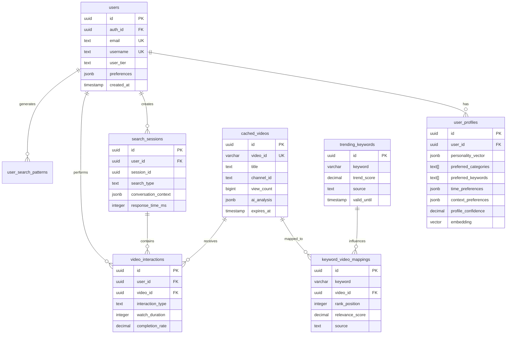

# 데이터베이스 설계 상세 (Database Design Detail)

## 4.1 데이터 모델링

### 4.1.1 ER 다이어그램



### 4.1.2 정규화 전략

### 현재 정규화 수준 분석

```sql
-- 1NF: 원자값 보장
-- ✓ 모든 컬럼이 원자값 (JSONB는 의도적 선택)

-- 2NF: 부분 함수 종속 제거
-- ✓ 복합키 없음, 모든 속성이 기본키에 완전 함수 종속

-- 3NF: 이행적 함수 종속 제거
-- ✓ 대부분 충족, 일부 계산 필드는 성능을 위해 유지

-- BCNF: 모든 결정자가 후보키
-- ✓ 충족

```

### 의도적 비정규화 영역

```sql
-- 1. 계산된 필드 저장 (성능 최적화)
CREATE TABLE video_interactions (
  watch_duration INTEGER,
  total_duration INTEGER,
  -- 비정규화: 계산 가능하지만 저장
  completion_rate DECIMAL(3,2) GENERATED ALWAYS AS
    (CASE WHEN total_duration > 0
      THEN LEAST(watch_duration::DECIMAL / total_duration, 1.0)
      ELSE 0 END) STORED
);

-- 2. 집계 데이터 캐싱
CREATE TABLE keyword_performance_cache (
  keyword VARCHAR(100),
  date DATE,
  -- 비정규화: video_interactions에서 계산 가능
  total_views INTEGER,
  avg_completion_rate DECIMAL(3,2),
  total_likes INTEGER,

  PRIMARY KEY (keyword, date)
);

-- 3. JSONB 사용 (스키마 유연성)
CREATE TABLE user_profiles (
  -- 정규화하면 별도 테이블이 필요하지만 JSONB로 통합
  time_preferences JSONB, -- {morning: [...], afternoon: [...]}
  context_preferences JSONB -- {mood: {...}, activity: {...}}
);

```

### 4.1.3 비정규화 결정

### 비정규화 결정 매트릭스

```yaml
keyword_video_mappings.click_count:
  정규화시: video_interactions 테이블에서 COUNT
  비정규화 이유:
    - 매우 빈번한 조회 (초당 100회+)
    - JOIN 비용 절감
    - 실시간 정렬 필요
  트레이드오프:
    - 저장 공간 증가 (무시 가능)
    - 업데이트 복잡도 증가 (트리거로 해결)

user_profiles.personality_vector:
  정규화시: personality_dimensions 테이블 분리
  비정규화 이유:
    - AI 모델 출력 구조 유지
    - 벡터 연산 최적화
    - 스키마 유연성
  트레이드오프:
    - 쿼리 복잡도 증가 (GIN 인덱스로 해결)

cached_videos.ai_analysis:
  정규화시:
    - video_categories 테이블
    - video_keywords 테이블
    - video_emotions 테이블
  비정규화 이유:
    - AI 응답 구조 보존
    - 다중 JOIN 방지
    - 빠른 필터링
  트레이드오프:
    - 부분 업데이트 어려움 (전체 교체 방식 사용)

```

## 4.2 테이블 스키마

### 4.2.1 사용자 관련 테이블

### 확장된 사용자 활동 추적

```sql
-- 사용자 세션 상세
CREATE TABLE user_session_details (
  id UUID PRIMARY KEY DEFAULT gen_random_uuid(),
  user_id UUID REFERENCES users(id) ON DELETE CASCADE,
  session_id UUID NOT NULL,

  -- 디바이스 정보
  device_type TEXT CHECK (device_type IN ('mobile', 'tablet', 'desktop')),
  device_os TEXT,
  app_version TEXT,

  -- 네트워크 정보
  connection_type TEXT, -- 'wifi', '4g', '5g'

  -- 세션 메트릭
  session_start TIMESTAMP WITH TIME ZONE DEFAULT NOW(),
  session_end TIMESTAMP WITH TIME ZONE,
  total_videos_watched INTEGER DEFAULT 0,
  total_watch_time INTEGER DEFAULT 0, -- seconds

  -- 세션 품질
  avg_load_time_ms INTEGER,
  error_count INTEGER DEFAULT 0,

  -- 인덱스
  INDEX idx_session_user_time (user_id, session_start DESC)
);

-- 사용자 피드백 테이블
CREATE TABLE user_feedback (
  id UUID PRIMARY KEY DEFAULT gen_random_uuid(),
  user_id UUID REFERENCES users(id) ON DELETE CASCADE,
  video_id UUID REFERENCES cached_videos(id),
  session_id UUID,

  -- 피드백 타입
  feedback_type TEXT NOT NULL CHECK (
    feedback_type IN ('like', 'dislike', 'not_interested', 'report')
  ),

  -- 상세 피드백
  reason TEXT CHECK (
    reason IN ('irrelevant', 'seen_too_many', 'offensive', 'quality', 'other')
  ),
  comment TEXT,

  -- 컨텍스트
  source_keyword VARCHAR(100),
  position_in_list INTEGER,

  created_at TIMESTAMP WITH TIME ZONE DEFAULT NOW(),

  -- 복합 유니크 제약
  UNIQUE(user_id, video_id, feedback_type)
);

```

### 4.2.2 영상 캐싱 테이블

### 영상 품질 메트릭 테이블

```sql
-- 영상 품질 점수 상세
CREATE TABLE video_quality_scores (
  id UUID PRIMARY KEY DEFAULT gen_random_uuid(),
  video_id UUID REFERENCES cached_videos(id) ON DELETE CASCADE,

  -- 기본 메트릭
  engagement_rate DECIMAL(5,2), -- (likes + comments) / views * 100
  retention_rate DECIMAL(5,2),  -- 평균 시청 완료율

  -- AI 분석 점수
  content_quality DECIMAL(3,2), -- 0-1
  audio_quality DECIMAL(3,2),
  video_quality DECIMAL(3,2),
  relevance_score DECIMAL(3,2),

  -- 트렌드 점수
  trend_alignment DECIMAL(3,2),
  freshness_score DECIMAL(3,2),

  -- 종합 점수
  overall_score DECIMAL(3,2) GENERATED ALWAYS AS (
    content_quality * 0.3 +
    engagement_rate / 100 * 0.25 +
    retention_rate / 100 * 0.2 +
    trend_alignment * 0.15 +
    freshness_score * 0.1
  ) STORED,

  -- 메타데이터
  calculated_at TIMESTAMP WITH TIME ZONE DEFAULT NOW(),

  -- 인덱스
  INDEX idx_quality_overall (overall_score DESC),
  INDEX idx_quality_video (video_id)
);

-- 채널 정보 캐싱
CREATE TABLE cached_channels (
  id UUID PRIMARY KEY DEFAULT gen_random_uuid(),
  channel_id VARCHAR(50) UNIQUE NOT NULL,
  channel_title VARCHAR(200) NOT NULL,

  -- 채널 통계
  subscriber_count BIGINT,
  video_count INTEGER,
  total_view_count BIGINT,

  -- 채널 분석
  primary_category VARCHAR(50),
  content_language VARCHAR(10),
  upload_frequency DECIMAL(4,2), -- videos per week
  avg_video_quality DECIMAL(3,2),

  -- 신뢰도
  verified BOOLEAN DEFAULT FALSE,
  trust_score DECIMAL(3,2) DEFAULT 0.5,

  -- 캐싱 정보
  last_updated TIMESTAMP WITH TIME ZONE DEFAULT NOW(),

  -- 인덱스
  INDEX idx_channel_trust (trust_score DESC),
  INDEX idx_channel_category (primary_category)
);

```

### 4.2.3 상호작용 추적 테이블

### 상세 상호작용 분석

```sql
-- 영상 시청 이벤트 상세
CREATE TABLE watch_events (
  id UUID PRIMARY KEY DEFAULT gen_random_uuid(),
  interaction_id UUID REFERENCES video_interactions(id),

  -- 이벤트 타입
  event_type TEXT NOT NULL CHECK (
    event_type IN ('play', 'pause', 'seek', 'end', 'skip', 'replay')
  ),

  -- 이벤트 시점
  event_timestamp TIMESTAMP WITH TIME ZONE DEFAULT NOW(),
  video_timestamp INTEGER, -- 영상 내 위치 (초)

  -- 추가 데이터
  seek_from INTEGER, -- seek 이벤트시 이전 위치
  seek_to INTEGER,   -- seek 이벤트시 이후 위치

  -- 파티셔닝을 위한 날짜
  event_date DATE GENERATED ALWAYS AS (DATE(event_timestamp)) STORED
) PARTITION BY RANGE (event_date);

-- 월별 파티션 생성
CREATE TABLE watch_events_2025_06
  PARTITION OF watch_events
  FOR VALUES FROM ('2025-06-01') TO ('2025-07-01');

-- 키워드 효과성 분석
CREATE TABLE keyword_effectiveness (
  id UUID PRIMARY KEY DEFAULT gen_random_uuid(),
  keyword VARCHAR(100) NOT NULL,
  date DATE NOT NULL,

  -- 검색 메트릭
  search_count INTEGER DEFAULT 0,
  click_count INTEGER DEFAULT 0,
  ctr DECIMAL(5,2) GENERATED ALWAYS AS (
    CASE WHEN search_count > 0
    THEN (click_count::DECIMAL / search_count * 100)
    ELSE 0 END
  ) STORED,

  -- 시청 메트릭
  total_watch_time INTEGER DEFAULT 0,
  avg_completion_rate DECIMAL(5,2),

  -- 만족도 메트릭
  like_rate DECIMAL(5,2),
  skip_rate DECIMAL(5,2),

  PRIMARY KEY (keyword, date),
  INDEX idx_effectiveness_date (date DESC)
);

```

### 4.2.4 트렌드 데이터 테이블

### 트렌드 예측 및 분석

```sql
-- 트렌드 예측 모델 결과
CREATE TABLE trend_predictions (
  id UUID PRIMARY KEY DEFAULT gen_random_uuid(),
  keyword VARCHAR(100) NOT NULL,

  -- 예측 정보
  prediction_date DATE NOT NULL,
  predicted_for_date DATE NOT NULL,

  -- 예측 값
  predicted_score DECIMAL(5,2),
  confidence_interval NUMRANGE, -- [lower, upper]
  confidence_level DECIMAL(3,2),

  -- 모델 정보
  model_version VARCHAR(20),
  features_used JSONB,

  -- 실제 값 (나중에 업데이트)
  actual_score DECIMAL(5,2),
  prediction_error DECIMAL(5,2) GENERATED ALWAYS AS (
    ABS(predicted_score - actual_score)
  ) STORED,

  created_at TIMESTAMP WITH TIME ZONE DEFAULT NOW(),

  INDEX idx_prediction_keyword_date (keyword, predicted_for_date DESC)
);

-- 카테고리별 트렌드 집계
CREATE MATERIALIZED VIEW category_trend_summary AS
SELECT
  date_trunc('day', tk.valid_from) as trend_date,
  COALESCE(cv.ai_analysis->>'categories'->>0, 'unknown') as category,
  COUNT(DISTINCT tk.keyword) as trending_keyword_count,
  AVG(tk.trend_score) as avg_trend_score,
  ARRAY_AGG(DISTINCT tk.keyword ORDER BY tk.trend_score DESC)
    FILTER (WHERE tk.trend_score > 50) as top_keywords
FROM trending_keywords tk
LEFT JOIN keyword_video_mappings kvm ON tk.keyword = kvm.keyword
LEFT JOIN cached_videos cv ON kvm.video_id = cv.id
WHERE tk.valid_from >= NOW() - INTERVAL '30 days'
GROUP BY trend_date, category
ORDER BY trend_date DESC, avg_trend_score DESC;

-- 자동 리프레시
CREATE INDEX idx_trend_summary_date ON category_trend_summary(trend_date DESC);

```

## 4.3 인덱싱 및 최적화

### 4.3.1 복합 인덱스 설계

### 쿼리 패턴 기반 인덱스

```sql
-- 패턴 1: 사용자의 최근 시청 기록
CREATE INDEX idx_user_recent_watch ON video_interactions(
  user_id,
  created_at DESC
) INCLUDE (video_id, watch_duration, completion_rate)
WHERE interaction_type = 'view';

-- 패턴 2: 키워드별 고품질 영상
CREATE INDEX idx_keyword_quality_videos ON keyword_video_mappings(
  keyword,
  relevance_score DESC
) INCLUDE (video_id, rank_position)
WHERE relevance_score > 0.7;

-- 패턴 3: 시간대별 트렌드
CREATE INDEX idx_trend_time_score ON trending_keywords(
  time_slot,
  day_of_week,
  trend_score DESC
) INCLUDE (keyword, category)
WHERE valid_until > NOW();

-- 패턴 4: 채널별 최신 영상
CREATE INDEX idx_channel_recent_videos ON cached_videos(
  channel_id,
  published_at DESC
) INCLUDE (video_id, title, view_count)
WHERE is_shorts = TRUE AND quality_score > 0.6;

```

### 4.3.2 JSONB 인덱싱

### GIN 인덱스 최적화

```sql
-- 표현식 인덱스로 특정 경로 최적화
CREATE INDEX idx_ai_primary_category ON cached_videos
USING GIN ((ai_analysis->'categories'->0));

CREATE INDEX idx_user_morning_prefs ON user_profiles
USING GIN ((time_preferences->'morning'));

-- 부분 인덱스로 크기 최적화
CREATE INDEX idx_trending_music ON cached_videos
USING GIN (ai_analysis)
WHERE ai_analysis @> '{"categories": ["music"]}';

-- jsonb_path_ops로 성능 향상
CREATE INDEX idx_ai_analysis_path ON cached_videos
USING GIN (ai_analysis jsonb_path_ops);

-- 복합 GIN 인덱스
CREATE INDEX idx_video_metadata ON cached_videos
USING GIN (
  to_tsvector('korean', title || ' ' || description),
  ai_analysis
);

```

### 4.3.3 Supabase MCP 통합 최적화

### Edge Functions 연동

```sql
-- Supabase Edge Function 트리거
CREATE OR REPLACE FUNCTION notify_trend_update()
RETURNS TRIGGER AS $$
BEGIN
  -- Supabase MCP에 알림
  PERFORM
    net.http_post(
      url := 'https://api.supabase.co/functions/v1/trend-update',
      headers := jsonb_build_object(
        'Authorization', current_setting('app.supabase_key'),
        'Content-Type', 'application/json'
      ),
      body := jsonb_build_object(
        'keyword', NEW.keyword,
        'trend_score', NEW.trend_score,
        'source', NEW.source
      )
    );
  RETURN NEW;
END;
$$ LANGUAGE plpgsql;

CREATE TRIGGER trend_update_notification
AFTER INSERT OR UPDATE ON trending_keywords
FOR EACH ROW EXECUTE FUNCTION notify_trend_update();

-- RLS (Row Level Security) 정책
ALTER TABLE cached_videos ENABLE ROW LEVEL SECURITY;

CREATE POLICY "Public read access" ON cached_videos
  FOR SELECT USING (true);

CREATE POLICY "Authenticated write access" ON cached_videos
  FOR ALL USING (auth.role() = 'authenticated');

-- Supabase Realtime 구독을 위한 설정
ALTER PUBLICATION supabase_realtime ADD TABLE trending_keywords;
ALTER PUBLICATION supabase_realtime ADD TABLE user_feedback;

```

### 4.3.3 파티셔닝 전략

### 시계열 데이터 파티셔닝

```sql
-- 상호작용 테이블 파티셔닝
CREATE TABLE video_interactions_partitioned (
  LIKE video_interactions INCLUDING ALL
) PARTITION BY RANGE (created_at);

-- 자동 파티션 관리 함수
CREATE OR REPLACE FUNCTION create_monthly_partitions()
RETURNS void AS $$
DECLARE
  start_date date;
  end_date date;
  partition_name text;
  table_name text;
  i integer;
BEGIN
  -- 향후 3개월치 파티션 미리 생성
  FOR i IN 0..2 LOOP
    start_date := date_trunc('month', CURRENT_DATE + (i || ' months')::interval);
    end_date := start_date + interval '1 month';

    -- video_interactions 파티션
    partition_name := 'video_interactions_' || to_char(start_date, 'YYYY_MM');
    table_name := 'video_interactions_partitioned';

    EXECUTE format(
      'CREATE TABLE IF NOT EXISTS %I PARTITION OF %I
       FOR VALUES FROM (%L) TO (%L)',
      partition_name, table_name, start_date, end_date
    );

    -- 인덱스 생성
    EXECUTE format(
      'CREATE INDEX IF NOT EXISTS %I ON %I (user_id, created_at DESC)',
      partition_name || '_user_idx', partition_name
    );

    -- watch_events 파티션도 동일하게 처리
    partition_name := 'watch_events_' || to_char(start_date, 'YYYY_MM');

    EXECUTE format(
      'CREATE TABLE IF NOT EXISTS %I PARTITION OF watch_events
       FOR VALUES FROM (%L) TO (%L)',
      partition_name, start_date, end_date
    );
  END LOOP;

  -- 오래된 파티션 정리 (12개월 이상)
  FOR partition_name IN
    SELECT tablename
    FROM pg_tables
    WHERE schemaname = 'public'
    AND tablename LIKE 'video_interactions_%'
    AND tablename < 'video_interactions_' || to_char(CURRENT_DATE - interval '12 months', 'YYYY_MM')
  LOOP
    EXECUTE format('DROP TABLE IF EXISTS %I', partition_name);
  END LOOP;
END;
$$ LANGUAGE plpgsql;

-- 매월 1일 실행
SELECT cron.schedule('partition-maintenance', '0 0 1 * *', $$
  SELECT create_monthly_partitions();
$$);

```

## 4.4 보안 및 권한

### 4.4.1 Row Level Security

### 고급 RLS 정책

```sql
-- 컨텍스트 기반 접근 제어
CREATE POLICY "Premium features for premium users" ON search_sessions
  FOR ALL
  USING (
    CASE
      WHEN search_type = 'ai_chat' THEN
        EXISTS (
          SELECT 1 FROM users
          WHERE users.auth_id = auth.uid()
          AND users.user_tier IN ('premium', 'pro')
          AND users.subscription_end > NOW()
        )
      ELSE TRUE
    END
  );

-- 시간 기반 접근 제어
CREATE POLICY "Trial users limited access" ON video_interactions
  FOR INSERT
  WITH CHECK (
    CASE
      WHEN EXISTS (
        SELECT 1 FROM users
        WHERE users.auth_id = auth.uid()
        AND users.user_tier = 'trial'
      ) THEN
        -- 체험 사용자는 하루 50개 영상만
        (SELECT COUNT(*) FROM video_interactions
         WHERE user_id = auth.uid()
         AND created_at > CURRENT_DATE) < 50
      ELSE TRUE
    END
  );

-- 데이터 마스킹 정책
CREATE POLICY "Mask sensitive data for non-owners" ON users
  FOR SELECT
  USING (
    CASE
      WHEN auth.uid() = auth_id THEN TRUE
      WHEN auth.jwt() ->> 'role' = 'admin' THEN TRUE
      ELSE FALSE
    END
  )
  WITH CHECK (auth.uid() = auth_id);

```

### 4.4.2 역할 기반 접근 제어

```sql
-- 역할 정의
CREATE ROLE app_anonymous;
CREATE ROLE app_authenticated;
CREATE ROLE app_premium;
CREATE ROLE app_admin;
CREATE ROLE app_service;

-- 계층적 권한 부여
GRANT app_anonymous TO app_authenticated;
GRANT app_authenticated TO app_premium;
GRANT app_premium TO app_admin;

-- 테이블별 권한 설정
-- 익명 사용자
GRANT SELECT ON cached_videos TO app_anonymous;
GRANT SELECT ON trending_keywords TO app_anonymous;

-- 인증된 사용자
GRANT SELECT, INSERT ON video_interactions TO app_authenticated;
GRANT SELECT, INSERT, UPDATE ON users TO app_authenticated;
GRANT SELECT ON user_profiles TO app_authenticated;

-- 프리미엄 사용자
GRANT SELECT ON keyword_effectiveness TO app_premium;
GRANT SELECT ON category_trend_summary TO app_premium;

-- 관리자
GRANT ALL ON ALL TABLES IN SCHEMA public TO app_admin;

-- 서비스 계정 (백엔드)
GRANT ALL ON ALL TABLES IN SCHEMA public TO app_service;
GRANT EXECUTE ON ALL FUNCTIONS IN SCHEMA public TO app_service;

```

### 4.4.3 데이터 암호화

```sql
-- 컬럼 레벨 암호화
CREATE EXTENSION IF NOT EXISTS pgcrypto;

-- 암호화 키 관리
CREATE TABLE encryption_keys (
  id UUID PRIMARY KEY DEFAULT gen_random_uuid(),
  key_name TEXT UNIQUE NOT NULL,
  key_value TEXT NOT NULL, -- 실제로는 KMS에 저장
  created_at TIMESTAMP WITH TIME ZONE DEFAULT NOW(),
  rotated_at TIMESTAMP WITH TIME ZONE,
  is_active BOOLEAN DEFAULT TRUE
);

-- 민감 데이터 암호화 함수
CREATE OR REPLACE FUNCTION encrypt_pii(data text, key_name text DEFAULT 'default')
RETURNS text AS $$
DECLARE
  encryption_key text;
BEGIN
  SELECT key_value INTO encryption_key
  FROM encryption_keys
  WHERE key_name = key_name AND is_active = TRUE;

  IF encryption_key IS NULL THEN
    RAISE EXCEPTION 'Encryption key not found';
  END IF;

  RETURN pgp_sym_encrypt(data, encryption_key);
END;
$$ LANGUAGE plpgsql SECURITY DEFINER;

-- 복호화 함수 (권한 체크 포함)
CREATE OR REPLACE FUNCTION decrypt_pii(encrypted_data text, key_name text DEFAULT 'default')
RETURNS text AS $$
DECLARE
  encryption_key text;
  user_role text;
BEGIN
  -- 권한 확인
  user_role := current_setting('jwt.claims.role', true);
  IF user_role NOT IN ('admin', 'service') THEN
    RAISE EXCEPTION 'Insufficient privileges';
  END IF;

  SELECT key_value INTO encryption_key
  FROM encryption_keys
  WHERE key_name = key_name AND is_active = TRUE;

  RETURN pgp_sym_decrypt(encrypted_data::bytea, encryption_key);
END;
$$ LANGUAGE plpgsql SECURITY DEFINER;

-- 암호화된 사용자 정보 뷰
CREATE VIEW users_secure AS
SELECT
  id,
  username,
  decrypt_pii(email_encrypted) as email,
  user_tier,
  created_at
FROM (
  SELECT
    id,
    username,
    email as email_encrypted,
    user_tier,
    created_at
  FROM users
) u
WHERE current_setting('jwt.claims.role', true) IN ('admin', 'service');

```

### 4.4.4 감사 및 모니터링

```sql
-- 향상된 감사 로그
CREATE TABLE audit_logs_enhanced (
  id UUID PRIMARY KEY DEFAULT gen_random_uuid(),

  -- 기본 정보
  event_type TEXT NOT NULL, -- 'SELECT', 'INSERT', 'UPDATE', 'DELETE', 'FUNCTION'
  table_name TEXT,
  function_name TEXT,

  -- 사용자 정보
  user_id UUID,
  user_role TEXT,
  session_id TEXT,

  -- 요청 정보
  query_text TEXT,
  query_params JSONB,
  affected_rows INTEGER,

  -- 데이터 변경 추적
  old_data JSONB,
  new_data JSONB,
  changed_fields TEXT[],

  -- 컨텍스트
  ip_address INET,
  user_agent TEXT,
  request_id TEXT,

  -- 성능 메트릭
  execution_time_ms INTEGER,

  -- 타임스탬프
  created_at TIMESTAMP WITH TIME ZONE DEFAULT NOW()
) PARTITION BY RANGE (created_at);

-- 민감한 작업 실시간 알림
CREATE OR REPLACE FUNCTION notify_sensitive_operation()
RETURNS trigger AS $$
BEGIN
  IF TG_OP IN ('DELETE', 'TRUNCATE') OR
     (TG_OP = 'UPDATE' AND TG_TABLE_NAME = 'users') THEN

    PERFORM pg_notify('sensitive_operation', json_build_object(
      'operation', TG_OP,
      'table', TG_TABLE_NAME,
      'user', current_user,
      'time', NOW()
    )::text);
  END IF;

  RETURN NEW;
END;
$$ LANGUAGE plpgsql;

-- 성능 모니터링 뷰
CREATE VIEW database_health_metrics AS
SELECT
  'connection_count' as metric,
  count(*) as value,
  'connections' as unit
FROM pg_stat_activity
UNION ALL
SELECT
  'cache_hit_ratio',
  ROUND(sum(heap_blks_hit) / (sum(heap_blks_hit) + sum(heap_blks_read))::numeric, 4) * 100,
  'percentage'
FROM pg_statio_user_tables
UNION ALL
SELECT
  'transaction_rollback_ratio',
  ROUND(xact_rollback::numeric / (xact_commit + xact_rollback) * 100, 2),
  'percentage'
FROM pg_stat_database
WHERE datname = current_database()
UNION ALL
SELECT
  'slow_queries',
  count(*),
  'queries'
FROM pg_stat_statements
WHERE mean_exec_time > 100; -- 100ms

-- 자동 인덱스 추천
CREATE VIEW index_recommendations AS
WITH table_stats AS (
  SELECT
    schemaname,
    tablename,
    seq_scan,
    seq_tup_read,
    idx_scan,
    idx_tup_fetch,
    CASE WHEN seq_scan > 0
      THEN seq_tup_read::numeric / seq_scan
      ELSE 0
    END as avg_tuples_per_seq_scan
  FROM pg_stat_user_tables
)
SELECT
  schemaname,
  tablename,
  seq_scan,
  idx_scan,
  avg_tuples_per_seq_scan,
  pg_size_pretty(pg_total_relation_size(schemaname||'.'||tablename)) as table_size,
  CASE
    WHEN seq_scan > idx_scan AND avg_tuples_per_seq_scan > 1000 THEN
      'High sequential scan with large reads - consider indexing'
    WHEN seq_scan > 100 AND idx_scan = 0 THEN
      'No indexes used - consider adding indexes'
    ELSE 'OK'
  END as recommendation
FROM table_stats
WHERE seq_scan > 100
ORDER BY seq_scan DESC;

```