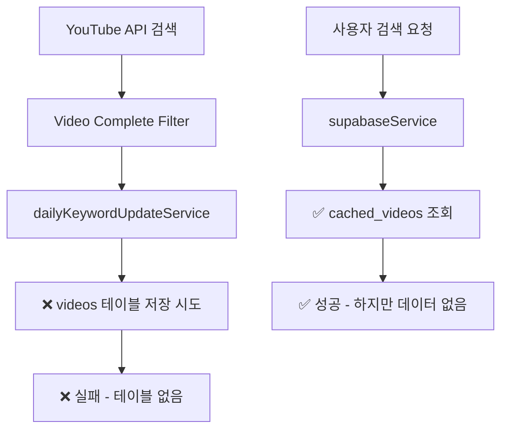
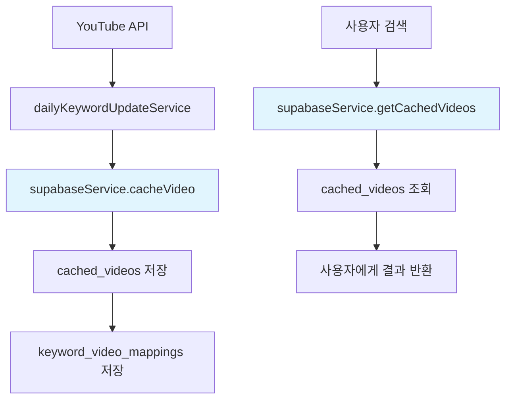

# 🚨 YouTube 큐레이팅 시스템 데이터베이스 아키텍처 문제 및 해결 계획

> **Critical Issue**: 2가지 다른 데이터베이스 구조가 혼재하여 시스템 통합 불가  
> **분석일**: 2025년 1월 3일  
> **우선순위**: 🔥 **Critical** - 즉시 해결 필요

---

## 🚨 **발견된 주요 문제점**

### 1. **2가지 다른 테이블 구조 혼재** (Critical)

#### 📊 **현재 구현된 스키마** (`schema-final.sql`)

```sql
-- 캐시 중심 구조
cached_videos              ✅ 실제 구현
keyword_video_mappings      ✅ 실제 구현
search_sessions            ✅ 실제 구현
trending_keywords          ✅ 실제 구현
```

#### 🎯 **미래 계획 스키마** (SEARCH_MODULE_GUIDE.md, dailyKeywordUpdateService.js)

```sql
-- 정규화된 구조
videos                     ❌ 계획만 존재 (TODO 상태)
channels                   ❌ 계획만 존재 (TODO 상태)
```

### 2. **서비스 레이어 불일치** (Critical)

| 서비스                           | 사용하는 테이블                           | 상태    | 문제점               |
| -------------------------------- | ----------------------------------------- | ------- | -------------------- |
| **supabaseService.js**           | `cached_videos`, `keyword_video_mappings` | ✅ 동작 | 현재 스키마 기준     |
| **dailyKeywordUpdateService.js** | `videos`, `channels`                      | ❌ TODO | 미래 스키마 기준     |
| **userAnalyticsService.js**      | `search_logs`                             | ❌ 오류 | 존재하지 않는 테이블 |

### 3. **데이터 플로우 단절** (Critical)



---

## 📋 **아키텍처 의사결정 계획**

### 🎯 **Option 1: 현재 스키마 확장** (권장)

#### ✅ **장점**

- **즉시 통합 가능**: 기존 코드 최소 수정
- **빠른 시간 내 완성**: 2-3일 내 완료 가능
- **안정성**: 이미 구현된 구조 활용

#### 📝 **필요한 수정사항**

1. **dailyKeywordUpdateService.js** 수정

   - `videos` → `cached_videos` 테이블 사용
   - `channels` → `cached_videos.channel_id` 활용

2. **userAnalyticsService.js** 수정

   - `search_logs` → `search_sessions` 테이블 사용
   - JOIN으로 `user_tier` 조회

3. **스키마 보완**
   - `cached_videos`에 품질 관련 컬럼 추가
   - 인덱스 최적화

#### 🔧 **구현 계획**

**Phase 1: 테이블명 통일** (1일)

```javascript
// dailyKeywordUpdateService.js 수정
- .from('videos')
+ .from('cached_videos')

// userAnalyticsService.js 수정
- .from('search_logs')
+ .from('search_sessions')
```

**Phase 2: 데이터 매핑 조정** (1일)

```javascript
// 영상 저장 로직 통합
async saveVideoToDB(videoData) {
  return await supabaseService.cacheVideo({
    id: videoData.id,
    snippet: {
      title: videoData.title,
      channelTitle: videoData.channelTitle,
      // ... 매핑
    },
    contentDetails: { duration: videoData.duration },
    statistics: {
      viewCount: videoData.viewCount,
      likeCount: videoData.likeCount
    }
  });
}
```

**Phase 3: 기능 통합 테스트** (1일)

---

### 🔮 **Option 2: 미래 스키마 완전 구현** (비권장)

#### ❌ **단점**

- **장기간 소요**: 1-2주 필요
- **대규모 리팩토링**: 모든 서비스 재작성
- **높은 리스크**: 기존 기능 동작 중단 가능성

#### 📊 **필요한 작업량**

```
1. videos/channels 테이블 생성      (2일)
2. supabaseService.js 전면 수정     (3일)
3. 모든 API 엔드포인트 수정         (3일)
4. 데이터 마이그레이션 스크립트     (2일)
5. 통합 테스트 및 디버깅           (3일)
---
총 소요 기간: 13일
```

---

## 🎯 **최종 권장사항: Option 1 선택**

### 🚀 **즉시 실행 계획** (3일 완료)

#### **Day 1: 긴급 수정**

- [ ] `userAnalyticsService.js` 테이블명 수정
- [ ] `dailyKeywordUpdateService.js` 테이블 매핑 수정
- [ ] 기본 동작 테스트

#### **Day 2: 데이터 플로우 통합**

- [ ] 영상 저장 로직 `supabaseService` 사용하도록 수정
- [ ] 키워드-영상 매핑 연동
- [ ] 중복 제거 로직 실제 DB 기반으로 수정

#### **Day 3: 최적화 및 테스트**

- [ ] 성능 인덱스 추가
- [ ] 전체 워크플로우 테스트
- [ ] 에러 처리 강화

### 📊 **통합 후 데이터 플로우**



---

## 🔍 **상세 수정 가이드**

### 1. **userAnalyticsService.js 수정**

#### 문제: `search_logs` 테이블 사용

```javascript
// ❌ 현재 코드 (Line 39, 86, 152, 177)
.from('search_logs')
.select('search_query, user_tier, created_at')  // user_tier 없음!
```

#### 해결: `search_sessions` + JOIN 사용

```javascript
// ✅ 수정된 코드
.from('search_sessions')
.select(`
  search_query,
  created_at,
  user_profiles!inner(user_tier)
`)
.gte('created_at', timeFilter)
.not('search_query', 'is', null)

// 사용자 티어 필터링
if (userTier !== 'all') {
  query = query.eq('user_profiles.user_tier', userTier);
}
```

### 2. **dailyKeywordUpdateService.js 수정**

#### 문제: `videos`, `channels` 테이블 사용 (존재하지 않음)

```javascript
// ❌ TODO 상태 코드 (Line 783-828)
INSERT INTO videos (video_id, title, ...)
INSERT INTO channels (channel_id, channel_title, ...)
```

#### 해결: `supabaseService` 활용

```javascript
// ✅ 수정된 코드
async saveVideoToDB(videoData) {
  // supabaseService의 기존 메서드 활용
  const cachedVideo = await supabaseService.cacheVideo({
    id: videoData.id,
    snippet: {
      title: videoData.title,
      channelTitle: videoData.channelTitle,
      channelId: videoData.channelId,
      description: videoData.description,
      tags: videoData.tags,
      thumbnails: { medium: { url: videoData.thumbnail } }
    },
    contentDetails: {
      duration: `PT${videoData.duration}S`
    },
    statistics: {
      viewCount: videoData.viewCount,
      likeCount: videoData.likeCount,
      commentCount: videoData.commentCount
    },
    status: {
      embeddable: videoData.isPlayable
    }
  });

  // 키워드 매핑 저장
  await supabaseService.addKeywordVideoMapping(
    videoData.searchKeyword,
    videoData.id,
    videoData.relevanceScore || 0.8
  );

  return cachedVideo;
}
```

### 3. **중복 제거 로직 실제 구현**

#### 문제: 30% 랜덤 목업 로직

```javascript
// ❌ 현재 목업 코드
videos.forEach((video) => {
  if (Math.random() < 0.3) {
    existingVideoIds.add(video.id);
  }
});
```

#### 해결: 실제 DB 조회

```javascript
// ✅ 실제 구현
async removeDuplicateVideos(videos, keyword) {
  const videoIds = videos.map(v => v.id);

  const existingVideos = await supabaseService.client
    .from('cached_videos')
    .select('video_id')
    .in('video_id', videoIds);

  const existingIds = new Set(
    existingVideos.data?.map(v => v.video_id) || []
  );

  const newVideos = videos.filter(v => !existingIds.has(v.id));

  console.log(`중복 제거: ${videos.length} → ${newVideos.length}`);
  return newVideos;
}
```

---

## 🚦 **실행 우선순위**

### 🔥 **즉시 수정 (오늘)**

1. **userAnalyticsService.js** 테이블명 수정 (30분)
2. **기본 동작 테스트** (30분)

### ⚡ **내일 완료**

1. **dailyKeywordUpdateService.js** 데이터 매핑 수정 (4시간)
2. **통합 테스트** (2시간)

### 🎯 **3일 내 완료**

1. **성능 최적화** (2시간)
2. **문서 업데이트** (1시간)
3. **최종 테스트** (1시간)

---

## 💡 **결론**

**현재 스키마 기반 통합**이 가장 현실적이고 안전한 선택입니다.

- ✅ **빠른 구현**: 3일 내 완료
- ✅ **낮은 리스크**: 기존 기능 유지
- ✅ **즉시 활용**: YouTube 큐레이팅 시스템 정상 동작

**다음 단계: 즉시 수정 작업을 시작하여 시스템을 통합하고, 이후 점진적으로 최적화해 나가는 것이 최선의 전략입니다.** 🚀
